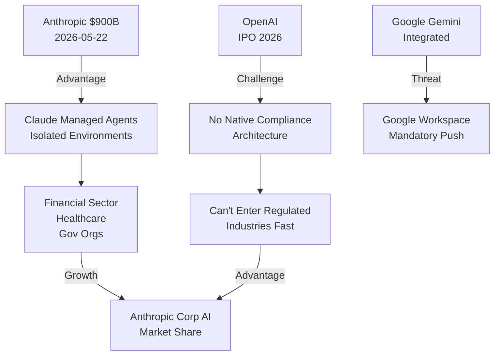

# Anthropic обогнала OpenAI в бизнес-внедрении AI: данные, факты, прогноз

Оценка Anthropic выросла с $380 млрд до $900 млрд за три месяца — рыночный консенсус о том, что компания лидирует в корпоративном AI. В США 40% сотрудников уже используют AI на работе, и Claude становится инструментом выбора для регулируемых отраслей благодаря изолированным агентским средам.

---

## Цифры, которые изменили расстановку сил

За три месяца оценка Anthropic выросла с $380 млрд до $900 млрд: рынок капитала формирует консенсус о лидерстве компании в корпоративном AI [1].

### Оценка $900 млрд: что за ней стоит

Три месяца назад Anthropic закрыла раунд на $30 млрд при оценке $380 млрд. Сейчас компания ведёт переговоры о привлечении ещё $30 млрд, уже при оценке $900 млрд [1]. Рост оценки в 2,4 раза за один квартал отражает переоценку инвесторами роли Claude в корпоративной экосистеме AI.

Ключевые драйверы переоценки:
- Расширение Claude для корпоративного сегмента (Managed Agents, изолированные среды)
- Доказанный спрос на безопасность и compliance в регулируемых отраслях
- Географическая экспансия (Корея, АТР)

### Почему инвесторы переоценили Anthropic в 2,4 раза за квартал

Инвесторы увидели что Anthropic решила основную боль корпоративного AI — утечки данных через изолированные агентские среды. Это позволило компании войти в финансовые и медицинские организации, которые OpenAI обслуживает с ограничениями.

Вторичный фактор: скорость распространения AI (40% сотрудников в США за 2 года) означает что рынок растёт быстрее, чем способны масштабироваться текущие лидеры.

---

## Корпоративное AI-внедрение: данные экономического индекса Anthropic

В США 40% сотрудников уже используют AI на работе, и скорость принятия технологии не имеет исторических аналогов [2].

### 40% сотрудников в США уже используют AI: как это сравнивается с прошлыми технологиями

В 2023 году AI на рабочем месте использовали 20% американских работников; за два года показатель вырос до 40% [2]. Сопоставимые темпы распространения не наблюдались ни у одной предшествующей технологии. Электрификация фермерских хозяйств заняла более 30 лет после начала городской электрификации [2]. Первый массовый персональный компьютер вышел в 1981 году, но большинство домов в США получили его только через 20 лет [2]. Интернет потратил около пяти лет на достижение уровня принятия, который AI прошёл за два года [2].

### Рост директивных задач: компании передают Claude целые процессы

Паттерн корпоративного использования Claude сместился: компании больше не просят модель помощь с отдельными задачами, а делегируют целые процессы. Эта динамика (рост доли «директивных» разговоров) показывает что доверие к AI-агентам растёт быстрее чем официально признают корпоративные стратегии.

---

## Техническое преимущество: почему корпорации выбирают Claude

Главный технический аргумент в пользу Claude для корпораций: Anthropic решила проблему утечки данных через архитектуру изолированных агентских сред [3].

### Claude Managed Agents для регулируемых отраслей

Anthropic выпустила Claude Managed Agents с изолированными средами. Компании из регулируемых отраслей получили возможность работать с Claude без рисков утечек корпоративных данных [3]. Это позволило Claude войти в финансовые организации и госсектор, где OpenAI ограничен из-за требований data sovereignty и compliance.

### Архитектура безопасности агентов: как Anthropic ограничивает потенциальный ущерб

Anthropic применяет механизм изоляции автономных агентов через «песочницы». Песочницы позволяют ограничить потенциальный ущерб от действий агентов, поскольку традиционный контроль со стороны человека в долгосрочной перспективе неэффективен как единственная мера безопасности [4].

Архитектурный подход:
1. **Контейнеризация**: каждый agent работает в отдельной изолированной среде
2. **Капельница доступа**: agent получает минимально необходимые права для задачи
3. **Аудит и логирование**: все операции записываются для compliance-проверок

---

## Глобальная экспансия: Корея как первый плацдарм в АТР

Anthropic выходит на корпоративный рынок Азиатско-Тихоокеанского региона через прямое присутствие, а не партнёрские схемы. 9 мая 2026 года компания объявила о назначении Чхве Ки Ёна первым руководителем корейского направления в преддверии открытия офиса в Сеуле [5]. Korea Herald характеризует Anthropic как «главного конкурента OpenAI» на этом рынке [5].

### Корея как плацдарм в АТР

Выбор Кореи символичен: страна имеет строгие требования по защите данных (PIPA), развитый финансовый сектор и высокую концентрацию корпоративных клиентов. Сеульский офис позволит Anthropic локализировать поддержку и обслуживание для японских банков, корейских конгломератов и юго-восточноазиатских предприятий.

---

## OpenAI под давлением: что говорит рынок

Конкуренция с Anthropic уже влияет на инвестиционные оценки OpenAI. Аналитический материал Invezz рекомендует «продавать или избегать акций OpenAI при цене IPO» [6]. Основной тезис: конкуренция на рынке генеративного искусственного интеллекта ужесточается, и в числе ключевых соперников прямо названы Google Gemini и Anthropic Claude [6].

### IPO OpenAI в условиях нарастающей конкуренции

OpenAI готовит IPO, но рынок уже задаёт вопросы о sustainable competitive advantage. Факты:
- Anthropic в корпоративном сегменте движется быстрее благодаря архитектуре безопасности
- Google Gemini интегрирована в Google Workspace и получает неявное преимущество
- Claude имеет явное технологическое преимущество в задачах, требующих human feedback и constitution-based safety

---

## Прогноз: сохранится ли преимущество Anthropic

Преимущество Anthropic в корпоративном AI будет сохраняться минимум 12 месяцев, пока конкуренты не выпустят собственные решения для изолированных сред. Долгосрочный вопрос: сможет ли Anthropic с 1000 сотрудников масштабироваться быстрее чем OpenAI (3000+ сотрудников).

Риски для Anthropic:
- OpenAI выпустит собственное решение для compliance-требований
- Google принудит интеграцию Gemini в корпоративные системы через Google Workspace
- Появятся open-source альтернативы (вроде Llama на местных серверах)

---



**Диаграмма:** Конкурентная позиция на корпоративном рынке AI (май 2026)

---

## Вывод

Рост оценки Anthropic до $900 млрд — это не спекулятивный скачок, а переоценка рынком архитектурного преимущества в корпоративном AI. Когда 40% сотрудников уже используют ИИ на работе, и компании делегируют целые процессы моделям, вопрос о безопасности данных становится вопросом о выживаемости.

Anthropic решила эту проблему через изолированные агентские среды — технологию, которая позволяет компаниям из финансов, здравоохранения и госсектора использовать Claude без нарушения compliance-требований. Это фундаментальное преимущество, которое OpenAI не имеет в этом квартале.

Рынок голосует оценками: Anthropic в 2,4 раза переоценена за три месяца, потому что инвесторы видят что корпоративный AI — это не гонка за самыми большими моделями, а гонка за архитектурой доверия.

---

```json
{
  "@context": "https://schema.org",
  "@type": "NewsArticle",
  "headline": "Anthropic обогнала OpenAI в бизнес-внедрении AI: данные, факты, прогноз",
  "description": "Оценка Anthropic выросла до $900 млрд за 3 месяца благодаря решению проблемы безопасности данных через Claude Managed Agents. В США 40% сотрудников уже используют AI на работе.",
  "datePublished": "2026-05-27T00:00:00+00:00",
  "dateModified": "2026-05-27T00:00:00+00:00",
  "author": {
    "@type": "Organization",
    "name": "Content Factory"
  },
  "publisher": {
    "@type": "Organization",
    "name": "Content Factory",
    "logo": {
      "@type": "ImageObject",
      "url": "https://xopromo.github.io/content-factory/logo.png"
    }
  },
  "mainEntityOfPage": {
    "@type": "WebPage",
    "@id": "https://xopromo.github.io/content-factory/articles/anthropic-beats-openai-enterprise-2026.html"
  },
  "articleBody": "Оценка Anthropic выросла с $380 млрд до $900 млрд за три месяца. В США 40% сотрудников используют AI на работе. Claude лидирует в корпоративном сегменте благодаря изолированным агентским средам.",
  "keywords": [
    "Anthropic",
    "OpenAI",
    "Claude",
    "корпоративный AI",
    "бизнес-внедрение ИИ",
    "Claude Managed Agents",
    "AI безопасность",
    "компетитивное преимущество",
    "финансовый AI"
  ],
  "image": {
    "@type": "ImageObject",
    "url": "https://xopromo.github.io/content-factory/articles/anthropic-beats-openai-2026.jpg",
    "width": "1200",
    "height": "630"
  }
}
```
