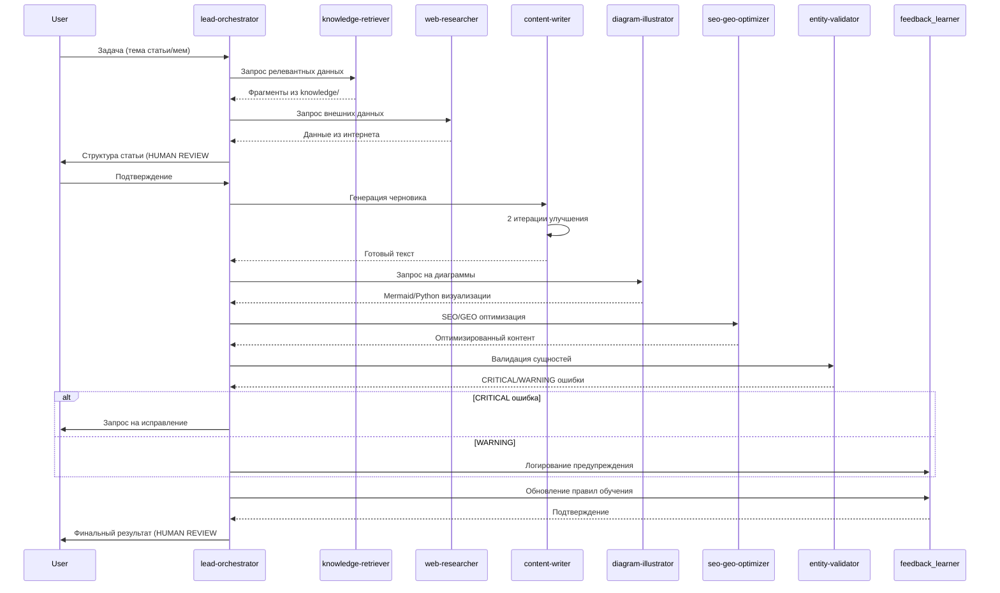
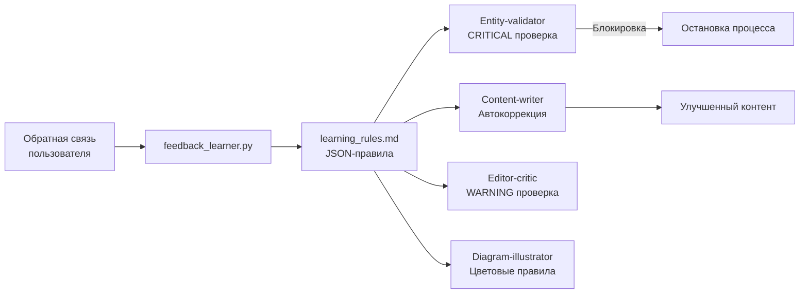
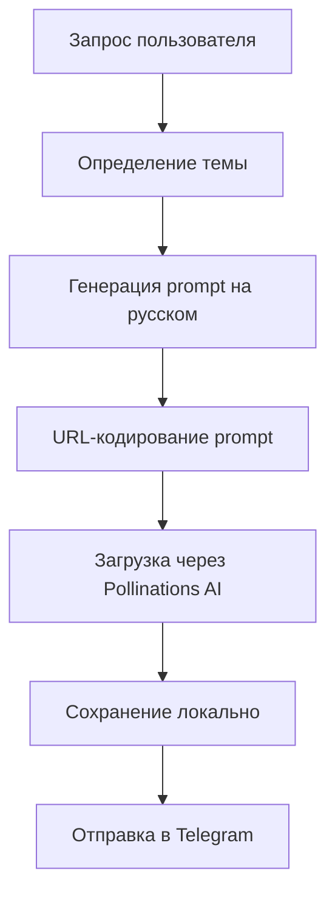

# Архитектура системы Jarvis (Antigravity)

## 1. Общая схема
```mermaid
flowchart TD
    subgraph User[Пользователь]
        A[Задача/Запрос] -->|Текст| B[Интерфейс
(Telegram/CLI)]
    end

    subgraph Core[Ядро системы]
        B --> C[CLAUDE.md
Маршрутизатор контекста]
        C --> D[PROJECT_STATE.md
Текущий статус проекта]
        C --> E[ai-clone/rules.md
Tone of Voice]
        C --> F[ai-clone/feedback/*.md
Обратная связь]

        D --> G[Оркестратор
scripts/orchestrator.py]
        G --> H[Рой агентов
(9 субагентов)]
        H --> I[Entity-validator
Шаг 6.7]
        H --> J[Feedback Learner
scripts/feedback_learner.py]
    end

    subgraph Knowledge[База знаний]
        K[knowledge/
Транскрипты, статьи] --> H
        L[business/
Продукты и ЦА] --> H
        M[plans/
Чек-листы] --> H
    end

    subgraph Tools[Инструменты]
        N[GitHub
xopromo/content-factory] --> H
        O[GitHub Pages
main/docs] --> H
        P[DuckDuckGo
Поиск] --> H
        Q[Pollinations AI
Генерация изображений] --> H
    end

    subgraph Output[Результаты]
        H --> R[Статьи
SEO+GEO оптимизированные]
        H --> S[Диаграммы
Mermaid/Python]
        H --> T[Мемы
Генерация изображений]
        R --> U[GitHub Pages
Публикация]
    end

    style Core fill:#120A8F,color:white
    style Knowledge fill:#FFD700,color:black
    style Tools fill:#00FF00,color:black
    style Output fill:#FF6347,color:white
```

## 2. Поток обработки запроса (14 шагов + валидаторы)


## 3. Ключевые компоненты

### 3.1 Рой агентов (9 субагентов)
| Агент | Роль | Инструменты |
|-------|------|-------------|
| lead-orchestrator | Управление процессом | Git, PROJECT_STATE.md |
| knowledge-retriever | Поиск по базе знаний | ripgrep, семантический поиск |
| web-researcher | Сбор внешних данных | DuckDuckGo, GitHub API |
| content-writer | Генерация контента | ai-clone/rules.md, feedback |
| diagram-illustrator | Визуализация | Mermaid, Python PIL |
| seo-geo-optimizer | Оптимизация | LSI-ключи, Schema.org |
| fact-checker | Проверка фактов | Внешние API, knowledge/ |
| editor-critic | Редактирование | ai-clone/rules.md |
| publisher | Публикация | GitHub Pages, Git |

### 3.2 Система обучения на обратной связи


### 3.3 Entity-validator (3 слоя проверки)
1. **Базовый fact-checker** - проверка фактов (числа, даты)
2. **Программная проверка** - validate_entity_names():
   - Извлечение капитализированных слов
   - Точное совпадение с источниками
   - Поиск похожих слов (Левенштейн > 75%)
3. **Пайплайнная проверка** - шаг 6.7:
   - CRITICAL: полное несовпадение → блокировка
   - WARNING: похожие слова → логирование

## 4. Пример работы с обратной связью
```json
{
  "rule_id": "lr-003",
  "trigger": "Devika|Devica|Devicka",
  "action": "Заменить на 'Devin'",
  "severity": "CRITICAL",
  "source": "user_correction_2026-05-27",
  "applied_to": ["content-writer", "entity-validator"]
}
```

## 5. Технические особенности
- **Автономность**: 90% операций без подтверждения пользователя
- **Git-интеграция**: Каждое изменение коммитится в main
- **Цветовая схема**: Ультрамариновый синий (#120A8F) как основной
- **GEO-оптимизация**: Первые предложения - самодостаточные ответы
- **Модульность**: Каждый агент - отдельный Python-модуль

## 6. Пример генерации мема


Сгенерирую диаграмму в виде изображения для наглядности.